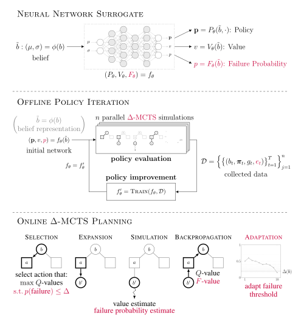

# ConstrainedZero.jl

[](https://arxiv.org/abs/2405.00644)

Belief-state planning algorithm for chance-constrained POMDPs (CC-POMDPs) using learned approximations; integrated into the [POMDPs.jl](https://github.com/JuliaPOMDP/POMDPs.jl) ecosystem.

<!--  -->
<!--  -->

<p align="center">
    
</p>


## Citation
```
@inproceedings{moss2024constrainedzero,
  title={{ConstrainedZero: Chance-Constrained POMDP Planning Using Learned Probabilistic Failure Surrogates and Adaptive Safety Constraints}},
  author={Moss, Robert J. and Jamgochian, Arec and Fischer, Johannes and Corso, Anthony and Kochenderfer, Mykel J.},
  booktitle={International Joint Conference on Artificial Intelligence (IJCAI)},
  year={2024},
}
```

## Installation
To install the ConstainedZero algorithm, use the `#safety` branch of [BetaZero.jl](https://github.com/sisl/BetaZero.jl/tree/safety). To install the constrained BetaZero solver, run:

```julia
using Pkg
Pkg.add(url="https://github.com/sisl/BetaZero.jl", rev="safety")
```

(**Optional**) To install the supporting example POMDP models (e.g., `LightDark` and `MinEx`), the `RemoteJobs` package, and the `ParticleBeliefs` wrapper, run:
```julia
using BetaZero
install_extras()
```


## Usage

The following code sets up the necessary interface functions `BetaZero.input_representation` and the optional `BetaZero.accuracy` for the _LightDark_ POMDP problem and solves it using BetaZero.

```julia
using BetaZero
using LightDark

pomdp = LightDarkPOMDP()
up = BootstrapFilter(pomdp, 500)

function BetaZero.input_representation(b::ParticleCollection{LightDarkState})
    # Function to get belief representation as input to neural network.
    μ, σ = mean_and_std(s.y for s in particles(b))
    return Float32[μ, σ]
end

function BetaZero.accuracy(pomdp::LightDarkPOMDP, b0, s0, states, actions, returns)
    # Function to determine accuracy of agent's final decision.
    return returns[end] == pomdp.correct_r
end

solver = BetaZeroSolver(pomdp=pomdp,
                        updater=up,
                        params=BetaZeroParameters(
                            n_iterations=50,
                            n_data_gen=50,
                        ),
                        nn_params=BetaZeroNetworkParameters(
                            pomdp, up;
                            training_epochs=50,
                            n_samples=100_000,
                            batchsize=1024,
                            learning_rate=1e-4,
                            λ_regularization=1e-5,
                            use_dropout=true,
                            p_dropout=0.2,
                        ),
                        verbose=true,
                        collect_metrics=true,
                        plot_incremental_data_gen=true)

policy = solve(solver, pomdp)
save_policy(policy, "policy.bson")
save_solver(solver, "solver.bson")
```
This example is also located at: [`scripts/readme_example.jl`](https://github.com/sisl/BetaZero.jl/blob/main/scripts/readme_example.jl)

## ConstrainedZero usage
To run using ConstainedZero, turn on the `is_constrained` flag in the `BetaZeroSolver`:
```julia
solver.is_constrained = true
```
> NOTE: Make sure to remove any failure penalties from the POMDP reward function as well, e.g.,:
```julia
pomdp.incorrect_r = 0 # for LightDark CC-POMDP
```

Set the $\Delta_0$ chance constraint and the $\eta$ adaptive conformal inference learning rate via:
```julia
solver.mcts_solver.Δ0 = 0.01
solver.mcts_solver.η = 0.00001
```

ConstrainedZero criteria:
```julia
# ConstrainedZero: To use the CC-PUCT criteria that is subject to the failure probability threshold, use:
solver.mcts_solver.final_criterion = SampleZQNS(τ=1, zq=1, zn=1)

# ConstrainedZero: Or for the argmax, use:
solver.mcts_solver.final_criterion = MaxZQNS(zq=1, zn=1)
```
